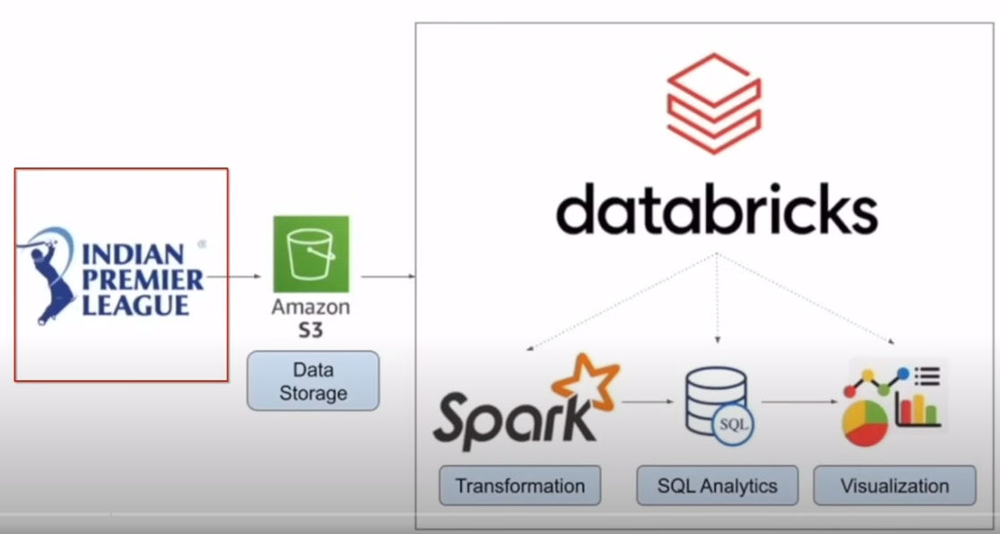

# IPL Data Analysis Apache Spark Project

## Introduction 
This project creates a data engineering pipeline using Amazon S3 and Databricks to ingest, process, and analyze IPL data, extracting valuable business insights.

We are going to use different technologies such as Python, Amazon Web Services (AWS), Apache Kafka, Glue, Athena, and SQL.

## Technology Used

Amazon S3: Scalable data storage 
Databricks: Data preprocessing and transformation 
SQL: Data querying 
Python: Data processing and visualization

## Architecture 

